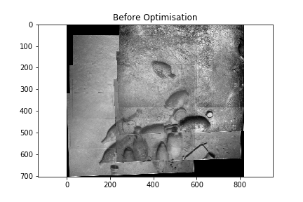
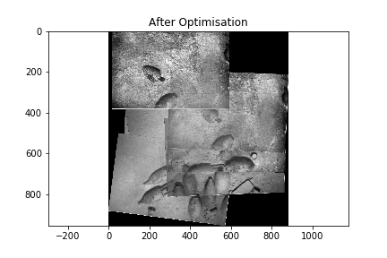

### HW3 comprises of different parts:

1. **Part 1** - *Stitch 6 Images from the dataset by computing their homographies and removing the outliers*
2. **Part 2** - *Tried Stiching for a greater dataset of 29 Images*

 
  
In this repository, I tried to stitch 6 images from the dataset using Bundle Adjustment. Although the results are not perfect even for the 29 images as the stiching algorithm is not robust enough to handle such large number of images. Also one flaw in the algorithm is that if 29 images are given, it tries to form Homography matrices between all the images in permutation and combination manner which is not a good approach and is computationally expensive. Below are the results for 6 images.

**Feature Detector** - In part 1, I found that Clahe only worked for me for inital 2/3 images, hence I only applied CLAHE to those images.This code uses Brute Force Matcher (BF Matcher) to find the matches and get the good matches out of those. I am using SIFT detector here. I also tested it with ORB, but the output by ORB gets worse after 4 images, (which should not be the case as in certain papers they claim that ORB outperforms SIFT because of its bitwise descriptor).

**RANSAC** - The Homography matrix estimation is done by RANSAC. I also tried estimating the affine transformation matrix,but the results were a bit off.

**Image Stitching and Panorama generation** - For panorama generation and estimating the location of image before sticching, I take four corners of the image and then multiply it with its respective H matrix. Then in those four warped points if any of the *x,y* is out of canvas i.e negative, I shit the previous panorama/image by the absolute value of that shift i.e (np.roll), hence giving me shift in X and Y axes. After the shifts are available I warp and stitch the images.

**Mean/Alpha Bleding** - I found while naively applying alpha blending is it also blends the black pixels of the warped image hence making the blended image darker and darker as the number of images increases, hence I applied what I call a "*Mean Blending*", here I copy the non zeros pixels of both the images and then perform Alpha blending hence, only the non zero pixels gets blended.

Go around the entire loop of 6 images and set up the problem by outputting vertices and edges in terms of a factor graph

**Pose 2 genetation** - We all know that the H matrix is a combination of camera intrinsics, Rotation and Translation matrix as.
$$\mathbf{H} = \mathbf{K} \cdot \mathbf{R} \cdot \mathbf{T}$$, Where:

$$
\begin{align*}
    \mathbf{K} & : \text{Intrinsic camera matrix} \\
    \mathbf{R} & : \text{Extrinsic rotation matrix} \\
    \mathbf{T} & : \text{Extrinsic translation vector} \\
\end{align*}
$$

Hence we can obtain the tranlation from the right top most element of the H matrix as:
$$\mathbf{H} =
\begin{bmatrix}
    h_{11} & h_{12} & x \\
    h_{21} & h_{22} & y \\
    h_{31} & h_{32} & 1 \\
\end{bmatrix}$$
Then I did SVD of the top left matrix of this H matrix to obtaint the Rotation matrix and then $$\tan^{-1}$$ will give me the pose of the image. Although there was no difference in this case where we directly take the top left corner of the H matrix to compute the value of $\theta$ or decompose it and then take proper rotation matrix because ther vertices are just points, but decomposing the top left of H matrix to obtain R matrix made sense theoretically.

This pose is then further given to the factor graph to generate the graph and then eventually optimise it using *Levenberg-Marquardt* algorithm.

The way I have calculated the covariance is based on the number of matches between the images, the more the matches the less the covariance. I have used the following formula to calculate the covariance:

$$\begin{align*}
    \text{covar\_multiplier} = \exp(n - \text{MAX\_MATCHES})\\
    exx = \left| \frac{x}{30} \right| \cdot \text{covar\_multiplier}\\
    eyy = \left| \frac{y}{30} \right| \cdot \text{covar\_multiplier}\\
    ett = \left| \frac{\theta}{30 \cdot 10.0} \right| \cdot \text{covar\_multiplier}\\
    \text{diag\_noise} = [ \text{exx}, \text{eyy}, \text{ett} ]
\end{align*}$$

The above expression is called exponential scaling of covariance based on the number of matches. Exponential scaling, which can provide more drastic adjustments based on the number of matches.

LIN_DIV is a constant or parameter that is used to divide the displacement values dx, dy, and dth in order to normalize them before applying the scaling factor covar_multiplier. It's essentially a divisor used to adjust the sensitivity of the covariance scaling based on the size of the displacement.

The choice of LIN_DIV should be based on the scale and units of your motion or displacement measurements. It can be used to control how much the covariance scales with respect to the magnitude of motion. A smaller LIN_DIV will result in larger covariances for the same magnitude of motion, while a larger LIN_DIV will result in smaller covariances.